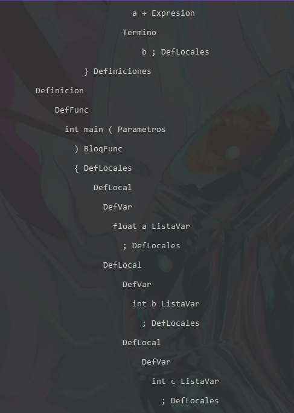

# Traductor de la materia Sem. Trad. 2
# Funcionamiento del proyecto final
Se comprobara el funcionamiento del proyecto con la cadena: 

"
int a;

int suma(int a, int b){
return a+b;
}

int main(){
float a;
int b;
int c;
c = a+b;
c = suma(8,9);
}
"

## Etapa de Analisis Léxico
En esta etapa se analiza y se divide la cadena por tokens y se guardan para el analizador sintactico.

Cuando finaliza la etapa imprime los tokens reconocidos:

## Etapa de Analisis sintactico
En esta etapa se hace el analisis sintactico usando una tabla LR y un algoritmo especial y se crea un arbol LR que se guardara para el analizador semantico.

Durante el proceso se va imprimiendo la pila del sintactico:

Al final muestra si la cadena fue aceptada o no

## Etapa del Arbol Sintactico
Al momento de hacer el analisis sintactico se fue creando el arbol sintactico guardando nodos en los no terminales y en los nodos almacenando los elementos eliminados.

En esta etapa se imprime el arbol creado (solo si la cadena fue aceptada sintacticamente):

## Etapa de Analisis Semantico
En esta etapa se analiza cada nodo y se verifica la semantica.

Al final se imprime la tabla de simbolos y la lista de errores.

# Mas ejemplos:

## Cadena lexicamente incorrecta
Si usamos una cadena lexica incorrecta será rechazada ej: "int main(){####a=b;}"

## Cadena Sintacticamente incorrecta
Si usamos una cadena sintacticamente incorrecta será igualmente rechazada ej: "int main(){int a" 

## Cadena semanticamente incorrecta
Si usamos una cadena semanticamente incorrecta no será rechazada pero si nos mostrara los errores semanticos del programa. 

Ej: 'int main (int x, int y) { int a,b,c; a=print(); b=z;} float c;'

# Comentarios sobre cada etapa
## Primera etapa del proyecto: Analizador Lexico
Mini analizador lexico que acepta los ismbolos de simbolos_lexicos.pdf

## Mini generador lexico: Analizador lexico arreglado
Mini genarador lexico que el profesor dejó terminaramos, y que reconoce ids, '+', floats e ints y los guarda para el analizador sintactico

## Etapa 2 Analisis Sintactico
Analizador sintactico que trabaja en conjunto con el analizador lexico para resolver los ejercicios 1 y 2 

19/02/20222 No me di cuenta que las listas fuera del constructor se comparten con todas las instancias, aunque no genera ningun problema porque el constructor vuelve a pushear '$' y '0' y el algoritmo vuelve a funcionar como si fuera una pila vacia jajaja. Funciona correctamente simplemente es raro de ver.

## Etapa 3
Analizador Sintáctico (Implementación usando Objetos)

IDEA: checar con más tablas LR

## Etapa 4: Gramatica del Compilador
Se lee una gramatica desde un arhivo externo y se pasa a la gramatica del analizador sintactico

IDEA: Checar las reglas a fondo, espero que el analizador lexico ya no tenga bugs

## Etapa 5 Arbol Sintactico
Creacion del arbol sintactico a partir de nodos (sin la creacion de las 52 clases) y una lista que almacena los nodos como si se tratara de un arbol. Arregle el lexico ya que dejaba pasar tokens que no debian entrar al sintactico.

## Etapa 6 Analisis Semantico
Recorrido del arbol sintactico comprobando la semantica de cada uno de los nodos y sus posibles errores, utilizando un arbol de nodos genericos y no los 52 nodos que se habian pedido.